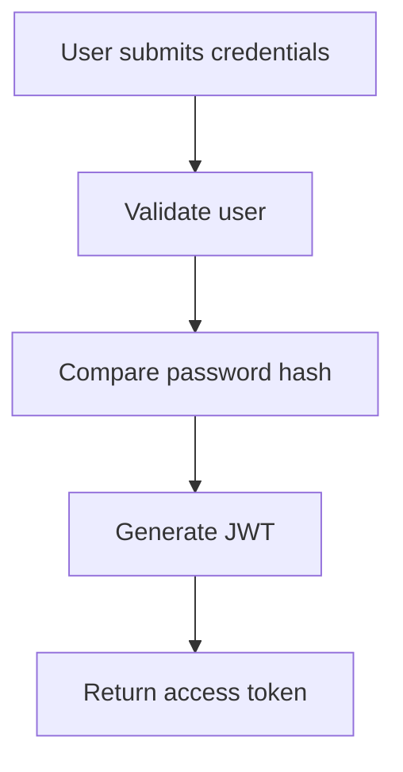
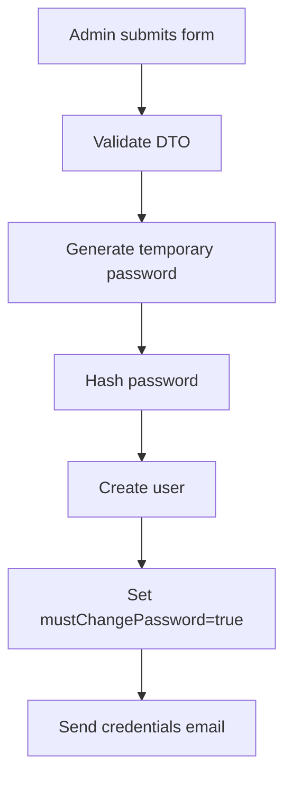
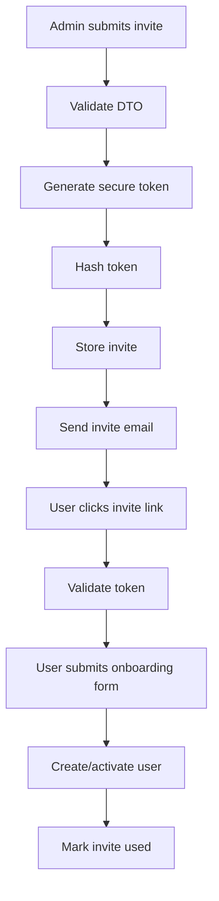

# Church Management System — Auth & User Management Architecture Guide

## Objective

Build a production-grade authentication and user onboarding system for a scalable Church Management Platform using:

- NestJS
- PostgreSQL
- Prisma ORM
- JWT Authentication
- Role-Based Access Control (RBAC)
- DTO Validation
- Modular Architecture

The goal is to implement this like a real enterprise system, not a tutorial project.

---

# Core Architectural Principles

## 1. Use Modular Architecture

Structure the backend as a modular monolith.

```bash
/src
  /modules
    /auth
    /users
    /invites
    /notifications
  /common
    /guards
    /decorators
    /utils
  /config
```

Each module should encapsulate:

```bash
module/
  module.controller.ts
  module.service.ts
  module.repository.ts
  module.module.ts
  dto/
  entities/
```

---

## 2. Separation of Concerns

Responsibilities must remain isolated.

### Controllers

Handle:

- HTTP requests
- Route definitions
- DTO validation

Controllers should NOT contain business logic.

---

### Services

Handle:

- Business logic
- Workflow orchestration
- Validation beyond DTOs

---

### Repositories

Handle:

- Database access
- Prisma queries

---

### Notifications Module

Responsible ONLY for:

- Sending emails
- Future SMS support
- Notification templates

---

# Authentication Strategy

## JWT Authentication

Use:

- Access Tokens
- Password hashing with bcrypt

### Login Flow



---

# Role-Based Access Control (RBAC)

## Roles

Supported roles:

- ADMIN
- FINANCE
- DEPARTMENT_LEADER
- VIEWER

---

## Authorization

Use NestJS Guards.

Example:

```ts
@Roles('ADMIN')
@UseGuards(JwtAuthGuard, RolesGuard)
```

---

# Database Design

Use PostgreSQL with Prisma ORM.

---

# Prisma Schema Design

## User Status Enum

```prisma
enum UserStatus {
  ACTIVE
  PENDING
}
```

---

## Role Enum

```prisma
enum UserRole {
  ADMIN
  FINANCE
  DEPARTMENT_LEADER
  VIEWER
}
```

---

## User Model

```prisma
model User {
  id                    String      @id @default(uuid())
  email                 String      @unique
  password              String?
  firstName             String?
  lastName              String?
  role                  UserRole
  status                UserStatus  @default(PENDING)
  mustChangePassword    Boolean     @default(false)
  createdAt             DateTime    @default(now())
  updatedAt             DateTime    @updatedAt
}
```

---

## User Invite Model

```prisma
model UserInvite {
  id          String    @id @default(uuid())
  email       String
  role        UserRole
  tokenHash   String
  expiresAt   DateTime
  used        Boolean   @default(false)
  createdAt   DateTime  @default(now())
}
```

---

# DTO Implementation

Use:

- class-validator
- class-transformer

ValidationPipe must be globally enabled.

Example:

```ts
app.useGlobalPipes(
  new ValidationPipe({
    whitelist: true,
    forbidNonWhitelisted: true,
    transform: true,
  }),
);
```

---

# Required DTOs

## CreateUserDto

Purpose:
Manual user creation by admin/staff.

Fields:

- email
- firstName
- lastName
- role

Requirements:

- Validate email format
- Validate role enum
- Require names

---

## InviteUserDto

Purpose:
Invite user via email.

Fields:

- email
- role

Requirements:

- Validate email
- Validate role enum

---

## AcceptInviteDto

Purpose:
Allow invited user to complete onboarding.

Fields:

- token
- password
- firstName
- lastName

Requirements:

- Password minimum length
- Validate token presence
- Validate required fields

---

## LoginDto

Fields:

- email
- password

---

# User Creation Flows

# 1. Manual User Creation

## Description

Admin manually creates a user account.

System generates a temporary password.

User is forced to change password after first login.

---

## Flow



---

## Requirements

- Passwords must be hashed
- Temporary passwords should not be stored in plain text
- User status should be ACTIVE
- mustChangePassword must be true

---

# 2. Invite User Flow

## Description

Admin invites user by email.

User completes onboarding later.

---

## Flow



---

## Security Requirements

- Never store raw invite tokens
- Store only hashed token
- Invite tokens must expire
- Invite tokens must be single-use

---

# API Design

## Auth Routes

```http
POST /auth/login
POST /auth/change-password
POST /auth/accept-invite
```

---

## User Routes

```http
POST /users
GET /users
GET /users/:id
PATCH /users/:id
```

---

## Invite Routes

```http
POST /users/invite
GET /users/invite/validate
```

---

# Frontend Expectations

The frontend should:

- Use next + TypeScript + shadcn + react-icons
-
- Use React Query for server state
- Use Zod or equivalent for form validation
- Implement protected routes
- Implement role-aware UI rendering

---

# Recommended Frontend Structure

```bash
/src
  /app
  /features
    /auth
    /users
    /invites
  /shared
    /components
    /hooks
    /lib
```

---

# Email Requirements

Emails required:

1. Temporary password email
2. Invite email
3. Password reset email (future)

Use template-based email rendering.

---

# Security Requirements

Must implement:

- Password hashing (bcrypt)
- DTO validation
- JWT auth guards
- RBAC guards
- Environment variables
- Rate limiting on auth routes
- Input sanitization

---

# Engineering Standards

## Code Quality

- Strict TypeScript
- Avoid business logic in controllers
- Keep services focused
- Use reusable utilities
- Use consistent naming

---

## Error Handling

Use:

- NestJS Exceptions
- Centralized exception handling

Example:

```ts
throw new UnauthorizedException('Invalid credentials');
```

---

# Future Scalability Considerations

Architecture should support future additions:

- Attendance module
- Finance module
- SMS notifications
- Audit logging
- Multi-branch church support
- Mobile app support
- Real-time dashboards

---

# Important Constraints

Do NOT:

- Mix business logic into controllers
- Store raw passwords
- Store raw invite tokens
- Use a flat folder structure
- Build tightly coupled modules
- Overengineer with microservices

---

# Deliverables

Implement:

1. NestJS project setup
2. Prisma schema
3. DTOs
4. Auth module
5. Users module
6. Invite system
7. RBAC guards
8. Notification/email service
9. Protected routes
10. API validation

---

# Expected Outcome

The final implementation should demonstrate:

- Clean architecture
- Enterprise-grade authentication
- Scalable backend structure
- Proper separation of concerns
- Security awareness
- Production-ready engineering practices
