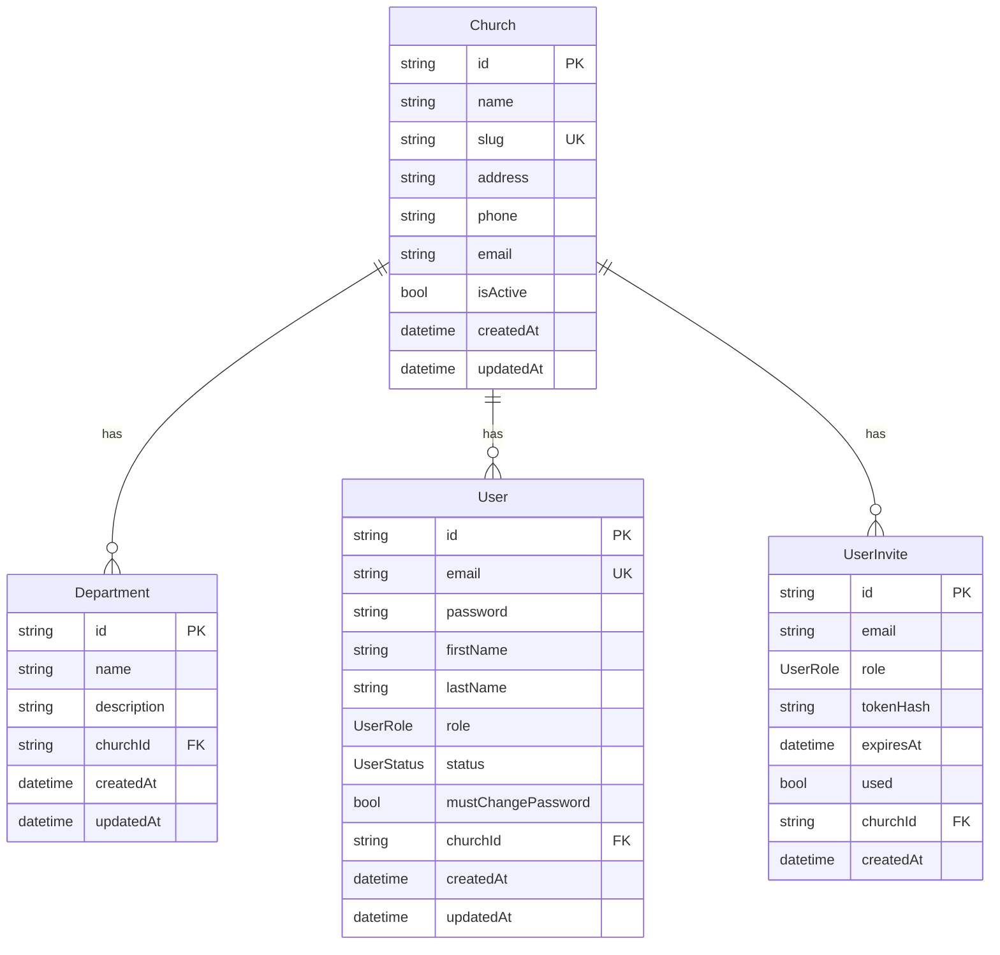

# Cathedral — ER Diagram

Source: `apps/api/prisma/schema.prisma` (PostgreSQL).

**Enums**
- `UserRole`: SUPER_ADMIN, ADMIN, FINANCE, DEPARTMENT_LEADER, VIEWER
- `UserStatus`: ACTIVE, PENDING

**Notes**
- `User.churchId` and `UserInvite.churchId` are nullable (SUPER_ADMIN has no church).
- `Department` is unique per `(churchId, name)`.
- All church relations cascade on delete.
