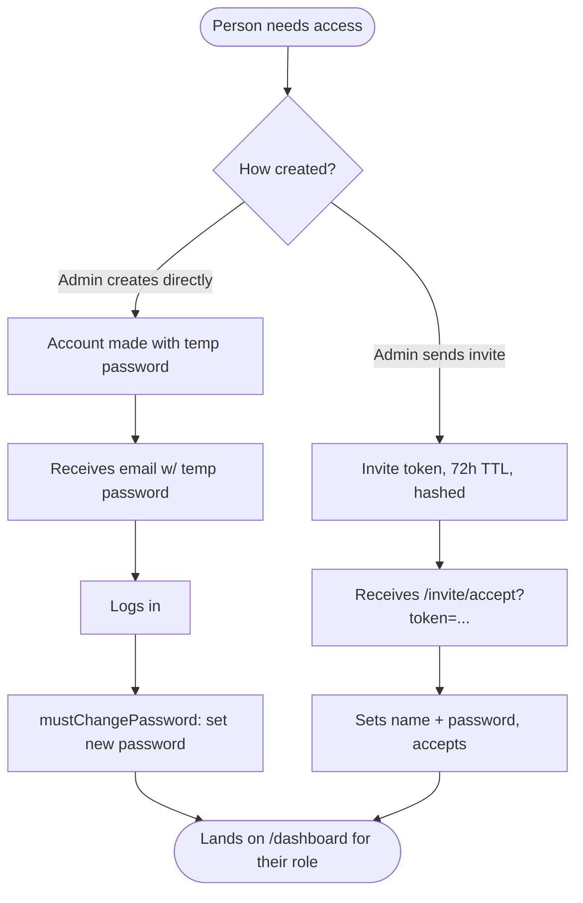
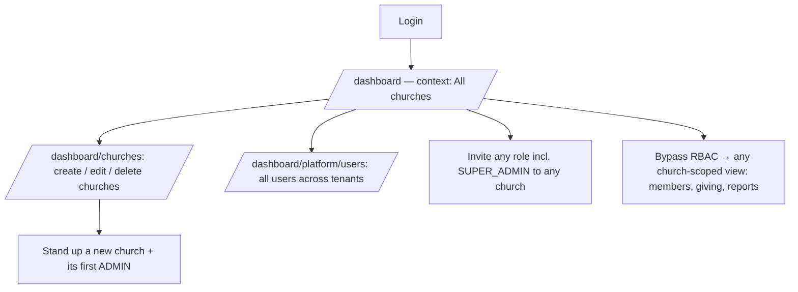
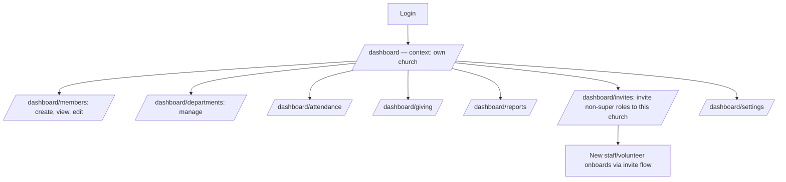
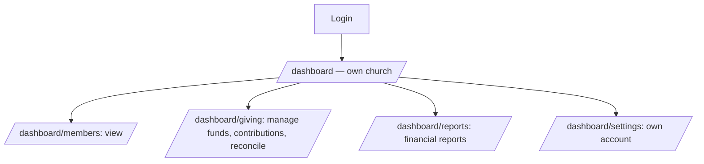
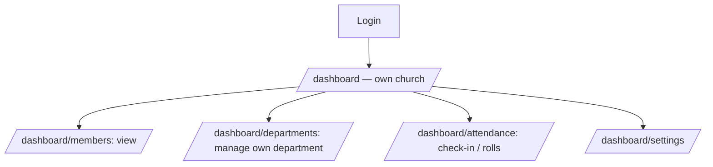
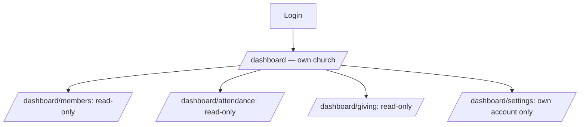

# Cathedral — User Flow Journeys

User journeys per role. Roles are defined in
[`apps/api/prisma/schema.prisma`](../apps/api/prisma/schema.prisma) (`UserRole`):
`SUPER_ADMIN`, `ADMIN`, `FINANCE`, `DEPARTMENT_LEADER`, `VIEWER`.

Tenancy: `SUPER_ADMIN` operates platform-wide (`churchId = null`); every other
role is scoped to one church. RBAC is enforced by
[`roles.guard.ts`](../apps/api/src/common/guards/roles.guard.ts) (super admin
bypasses all role gates) and by route `roles` in
[`apps/web/src/features/dashboard/nav.ts`](../apps/web/src/features/dashboard/nav.ts).

---

## Onboarding (how anyone gets in)

Notes:
- Only `ADMIN` (within own church) and `SUPER_ADMIN` (any church) can create/invite.
- Only `SUPER_ADMIN` can invite another `SUPER_ADMIN`.
- Accept-invite + validate-token endpoints are public; everything else needs auth.

---

## SUPER_ADMIN — platform operator

Entry points: Platform section of the sidebar (only role that sees it).

---

## ADMIN — church administrator

Full control of one church; cannot see other churches or platform pages.

---

## FINANCE — finance team

No departments, no invites, no attendance management.

---

## DEPARTMENT_LEADER — department leader

No giving, no reports, no invites.

---

## VIEWER — read-only

Sees data, changes nothing except own password.

---

### Capability matrix

| Capability | SUPER_ADMIN | ADMIN | FINANCE | DEPT_LEADER | VIEWER |
|---|---|---|---|---|---|
| Manage churches | ✓ | – | – | – | – |
| Platform users | ✓ | – | – | – | – |
| Create / invite users | ✓ (any) | ✓ (non-super) | – | – | – |
| Members | ✓ all | ✓ own | view | view | view |
| Departments | ✓ | ✓ | – | ✓ | – |
| Giving / finance | ✓ | ✓ | ✓ | – | view |
| Attendance | ✓ | ✓ | – | ✓ | view |
| Reports | ✓ | ✓ | ✓ | – | – |
| Tenant scope | platform | 1 church | 1 church | 1 church | 1 church |
